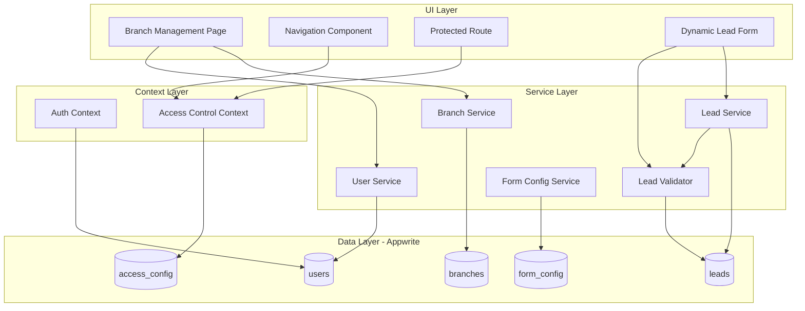

# Design Document: Admin & Branch Management

## Overview

This feature extends the SalesHub CRM with a three-tier role hierarchy (Admin > Manager > Agent) and a branch-based organizational structure. The Admin role can create branches, assign managers to branches, and perform all manager-level operations. Managers are scoped to their assigned branch, seeing only their branch's leads and agents. Lead duplicate validation (email and phone) operates globally across all branches.

The design builds on the existing Appwrite-backed architecture, adding a new `branches` collection, extending the `users` and `leads` collections with a `branchId` field, and introducing a `Lead_Validator` for cross-branch duplicate checking. The existing `form_config` and `access_config` collections remain global (not branch-scoped) since form fields and access rules should be consistent across the organization.

## Architecture



### Key Architectural Decisions

1. **Global form_config and access_config**: Form fields and access rules remain global. All branches use the same lead form structure and the same access control rules. This keeps configuration simple and consistent.

2. **branchId on users and leads**: Rather than creating junction tables, we add a `branchId` field directly to the `users` and `leads` collections. This is simpler and aligns with Appwrite's document model.

3. **Lead_Validator as a separate concern**: Duplicate checking is extracted into its own module (`lead-validator.ts`) that queries across all branches. This keeps the validation logic isolated and testable.

4. **Admin role inherits manager permissions**: The Access Control context treats `admin` as a superset of `manager`. Any check that passes for `manager` also passes for `admin`, plus admin gets branch management access.

## Components and Interfaces

### 1. Updated Types (`lib/types/index.ts`)

```typescript
// Extended role type
export type UserRole = 'admin' | 'manager' | 'agent';

// New Branch interface
export interface Branch {
  $id: string;
  name: string;
  isActive: boolean;
  $createdAt?: string;
  $updatedAt?: string;
}

export interface CreateBranchInput {
  name: string;
}

export interface UpdateBranchInput {
  name?: string;
  isActive?: boolean;
}

// Updated User interface
export interface User {
  $id: string;
  name: string;
  email: string;
  role: UserRole;
  managerId: string | null;
  branchId: string | null;
  $createdAt?: string;
  $updatedAt?: string;
}

// Updated Lead interface
export interface Lead {
  $id: string;
  data: string;
  status: string;
  ownerId: string;
  assignedToId: string | null;
  branchId: string | null;
  isClosed: boolean;
  closedAt: string | null;
  $createdAt?: string;
  $updatedAt?: string;
  $permissions?: string[];
}

// Lead validation result
export interface LeadValidationResult {
  isValid: boolean;
  duplicateField?: 'email' | 'phone';
  existingLeadId?: string;
  existingBranchId?: string;
}
```

### 2. Branch Service (`lib/services/branch-service.ts`)

```typescript
export async function createBranch(input: CreateBranchInput): Promise<Branch>;
export async function updateBranch(branchId: string, input: UpdateBranchInput): Promise<Branch>;
export async function deleteBranch(branchId: string): Promise<void>;
export async function getBranch(branchId: string): Promise<Branch>;
export async function listBranches(): Promise<Branch[]>;
export async function getBranchStats(branchId: string): Promise<{ managerCount: number; leadCount: number }>;
```

### 3. Lead Validator (`lib/services/lead-validator.ts`)

```typescript
export async function validateLeadUniqueness(
  data: LeadData,
  excludeLeadId?: string
): Promise<LeadValidationResult>;
```

This function queries the `leads` collection globally (no branch filter) to check for duplicate email and phone values. The `excludeLeadId` parameter is used during updates to exclude the lead being edited.

### 4. Updated User Service (`lib/services/user-service.ts`)

New and modified functions:

```typescript
// New: Create a manager (admin only)
export async function createManager(input: CreateManagerInput): Promise<User>;

// Modified: Accept branchId when creating agents
export async function createAgent(input: CreateAgentInput): Promise<User>;

// New: Assign manager to branch
export async function assignManagerToBranch(managerId: string, branchId: string): Promise<User>;

// New: Remove manager from branch
export async function removeManagerFromBranch(managerId: string): Promise<User>;

// Modified: Filter by branch
export async function getAgentsByManager(managerId: string): Promise<User[]>;
export async function getUsersByBranch(branchId: string): Promise<User[]>;
export async function getUnassignedManagers(): Promise<User[]>;
```

### 5. Updated Lead Service (`lib/services/lead-service.ts`)

Modified functions:

```typescript
// Modified: Include branchId when creating leads
export async function createLead(input: CreateLeadInput): Promise<Lead>;

// Modified: Filter by branchId for managers, show all for admins
export async function listLeads(
  filters: LeadListFilters,
  userId: string,
  userRole: UserRole,
  branchId?: string | null
): Promise<Lead[]>;
```

### 6. Updated Auth Context (`lib/contexts/auth-context.tsx`)

```typescript
export interface AuthContext {
  user: User | null;
  isAdmin: boolean;
  isManager: boolean;
  isAgent: boolean;
  loading: boolean;
  login: (email: string, password: string) => Promise<void>;
  logout: () => Promise<void>;
  signup: (name: string, email: string, password: string) => Promise<void>;
}
```

The `isAdmin` property is added. The `isManager` property returns `true` for both admin and manager roles (since admin inherits manager capabilities). The signup flow continues to create manager accounts by default — admin accounts are created through a separate controlled process (e.g., direct database seeding or an admin-only endpoint).

### 7. Updated Access Control Context (`lib/contexts/access-control-context.tsx`)

```typescript
export type ComponentKey =
  | 'dashboard'
  | 'leads'
  | 'history'
  | 'user-management'
  | 'field-management'
  | 'settings'
  | 'branch-management';
```

The `canAccess` function is updated: admin users get access to everything including `branch-management`. Manager users get the same access as before but not `branch-management`. The access rules in `access_config` collecti
tem with a `Building2` icon from lucide-react, visible only to admin users.

## Data Models

### Appwrite Collections

#### `branches` (new collection)

| Attribute  | Type    | Required | Description                    |
|-----------|---------|----------|--------------------------------|
| name      | string  | yes      | Unique branch name             |
| isActive  | boolean | yes      | Whether the branch is active   |

#### `users` (modified)

| Attribute  | Type    | Required | Description                              |
|-----------|---------|----------|------------------------------------------|
| name      | string  | yes      | User's display name                      |
| email     | string  | yes      | User's email                             |
| role      | string  | yes      | 'admin', 'manager', or 'agent'           |
| managerId | string  | no       | ID of the manager (for agents)           |
| branchId  | string  | no       | ID of the assigned branch                |

#### `leads` (modified)

| Attribute    | Type    | Required | Description                              |
|-------------|---------|----------|------------------------------------------|
| data        | string  | yes      | JSON serialized lead data                |
| status      | string  | yes      | Lead status                              |
| ownerId     | string  | yes      | ID of the lead owner                     |
| assignedToId| string  | no       | ID of the assigned agent                 |
| branchId    | string  | no       | ID of the branch this lead belongs to    |
| isClosed    | boolean | yes      | Whether the lead is closed               |
| closedAt    | string  | no       | ISO timestamp of closure                 |

#### `access_config` (modified)

The `role` field now accepts `'admin' | 'manager' | 'agent'` instead of just `'manager' | 'agent'`.

### Updated Constants (`lib/constants/default-access.ts`)

```typescript
export type UserRole = 'admin' | 'manager' | 'agent';

export const DEFAULT_ACCESS_RULES: AccessRule[] = [
  // Admin rules
  { componentKey: 'branch-management', role: 'admin', allowed: true },
  { componentKey: 'dashboard', role: 'admin', allowed: true },
  { componentKey: 'leads', role: 'admin', allowed: true },
  { componentKey: 'history', role: 'admin', allowed: true },
  { componentKey: 'user-management', role: 'admin', allowed: true },
  { componentKey: 'field-management', role: 'admin', allowed: true },
  { componentKey: 'settings', role: 'admin', allowed: true },
  // Manager rules (unchanged)
  { componentKey: 'branch-management', role: 'manager', allowed: false },
  // ... existing manager/agent rules
  // Agent rules (unchanged)
  { componentKey: 'branch-management', role: 'agent', allowed: false },
  // ... existing agent rules
];
```

## Correctness Properties

*A property is a characteristic or behavior that should hold true across all valid executions of a system — essentially, a formal statement about what the system should do. Properties serve as the bridge between human-readable specifications and machine-verifiable correctness guarantees.*

### Property 1: Admin access is a superset of manager access

*For any* component key in the system, if a manager is granted access to that component, then an admin user is also granted access to that same component. Additionally, admin is granted access to `branch-management` which manager is not.

**Validates: Requirements 1.2, 1.3, 8.2, 8.4**

### Property 2: Manager is excluded from branch management

*For any* user with the manager role, the `canAccess('branch-management')` function returns false.

**Validates: Requirements 8.3**

### Property 3: Signup never creates admin accounts

*For any* name, email, and password provided to the signup function, the resulting user document has role `'manager'`, never `'admin'`.

**Validates: Requirements 1.4**

### Property 4: Branch creation sets active status

*For any* valid branch name, creating a branch results in a branch document with `isActive = true` and the provided name.

**Validates: Requirements 2.1**

### Property 5: Branch name uniqueness

*For any* existing branch, attempting to create another branch with the same name results in a rejection error.

**Validates: Requirements 2.5**

### Property 6: Branch deletion guard

*For any* branch that has at least one assigned manager or at least one active lead, attempting to delete that branch results in a rejection error. *For any* branch with zero managers and zero active leads, deletion succeeds.

**Validates: Requirements 2.3**

### Property 7: Branch listing includes correct stats

*For any* set of branches, managers, and leads, listing branches returns every branch with a `managerCount` equal to the number of managers whose `branchId` matches that branch, and a `leadCount` equal to the number of leads whose `branchId` matches that branch.

**Validates: Requirements 2.4**

### Property 8: Manager-to-branch assignment cascades to agents

*For any* manager with linked agents, assigning or reassigning the manager to a branch updates the manager's `branchId` to the target branch AND updates all linked agents' `branchId` to the same target branch.

**Validates: Requirements 3.1, 3.2**

### Property 9: Multiple managers per branch

*For any* branch that already has one or more assigned managers, assigning an additional manager to that branch succeeds without error.

**Validates: Requirements 3.3**

### Property 10: Manager removal cascades to agents

*For any* manager with linked agents who is removed from a branch, the manager's `branchId` is set to null AND all linked agents' `branchId` is set to null.

**Validates: Requirements 3.4**

### Property 11: Manager sees only branch leads

*For any* set of leads across multiple branches, when a manager lists leads, the returned leads all have a `branchId` matching the manager's `branchId`, and no leads from other branches are included.

**Validates: Requirements 4.1**

### Property 12: Manager sees only branch agents

*For any* set of agents across multiple branches, when a manager lists agents, the returned agents all have a `branchId` matching the manager's `branchId`, and no agents from other branches are included.

**Validates: Requirements 4.2**

### Property 13: Admin sees all leads across branches

*For any* set of leads across multiple branches, when an admin lists leads, the returned set includes leads from every branch.

**Validates: Requirements 4.3**

### Property 14: Admin sees all agents across branches

*For any* set of agents across multiple branches, when an admin lists agents, the returned set includes agents from every branch.

**Validates: Requirements 4.4**

### Property 15: Lead creation inherits creator's branchId

*For any* lead created by a user (manager or agent) who has a `branchId`, the resulting lead's `branchId` matches the creator's `branchId`.

**Validates: Requirements 4.5**

### Property 16: Cross-branch duplicate detection for email and phone

*For any* set of existing leads across multiple branches and a new lead whose email or phone matches an existing lead in any branch, the Lead_Validator detects the duplicate and returns an error identifying the duplicate field (`'email'` or `'phone'`).

**Validates: Requirements 5.1, 5.2, 5.3**

### Property 17: Duplicate check excludes self on update

*For any* existing lead being updated, the Lead_Validator excludes that lead's own ID from the duplicate check. A lead updating its own email/phone to the same value does not trigger a duplicate error.

**Validates: Requirements 5.4**

### Property 18: Admin can specify branchId on lead creation

*For any* admin user creating a lead with an explicit `branchId`, the resulting lead's `branchId` matches the specified value, regardless of the admin's own branch assignment.

**Validates: Requirements 6.1**

### Property 19: Admin can specify manager and branch on agent creation

*For any* admin user creating an agent with a specified `managerId` and `branchId`, the resulting agent document has those exact values.

**Validates: Requirements 6.2**

### Property 20: Branch update modifies specified fields only

*For any* branch and a partial update containing a subset of `{ name, isActive }`, the resulting branch reflects the updated fields while preserving unchanged fields.

**Validates: Requirements 2.2**

## Error Handling

| Scenario | Error Response | HTTP-like Code |
|----------|---------------|----------------|
| Create branch with duplicate name | `"A branch with this name already exists"` | 409 Conflict |
| Delete branch with assigned managers | `"Cannot delete branch with assigned managers"` | 400 Bad Request |
| Delete branch with active leads | `"Cannot delete branch with active leads"` | 400 Bad Request |
| Create lead with duplicate email | `{ duplicateField: 'email', existingLeadId, existingBranchId }` | 409 Conflict |
| Create lead with duplicate phone | `{ duplicateField: 'phone', existingLeadId, existingBranchId }` | 409 Conflict |
| Non-admin accesses branch management | Redirect to `/dashboard` | 403 Forbidden |
| Assign manager to non-existent branch | `"Branch not found"` | 404 Not Found |
| Manager accesses leads from another branch | Empty result set (filtered out) | 200 OK (empty) |

All errors thrown by services follow the existing pattern: `throw new Error(message)`. The UI catches these in try/catch blocks and displays them via toast notifications or inline error messages.

## Testing Strategy

### Testing Framework

- **Unit tests**: Jest (already configured in the project)
- **Property-based tests**: fast-check (already installed as a dependency)
- **Test structure**: Follows existing pattern in `tests/` directory

### Unit Tests

Unit tests cover specific examples, edge cases, and error conditions:

- Branch CRUD operations with mocked Appwrite calls
- Role hierarchy edge cases (admin accessing manager features)
- Lead validation with specific duplicate scenarios
- Navigation rendering for each role
- Access control for branch-management component key
- Agent cascade on manager reassignment with specific data

### Property-Based Tests

Property tests validate universal correctness properties using fast-check. Each property test:

- Runs a minimum of 100 iterations
- References its design document property number
- Uses the tag format: **Feature: admin-branch-management, Property {N}: {title}**
- Is implemented as a single `fc.assert(fc.property(...))` call

Property tests are organized in `tests/property/` following the existing pattern:

- `tests/property/branch-properties.test.ts` — Properties 4, 5, 6, 7, 9, 20
- `tests/property/branch-access-properties.test.ts` — Properties 1, 2, 3
- `tests/property/branch-lead-properties.test.ts` — Properties 11, 13, 15, 16, 17, 18
- `tests/property/branch-user-properties.test.ts` — Properties 8, 10, 12, 14, 19

### Dual Testing Approach

Unit tests and property tests are complementary:
- Unit tests catch concrete bugs with specific inputs and verify error messages
- Property tests verify general correctness across randomized inputs
- Together they provide comprehensive coverage of both specific and universal behaviors
