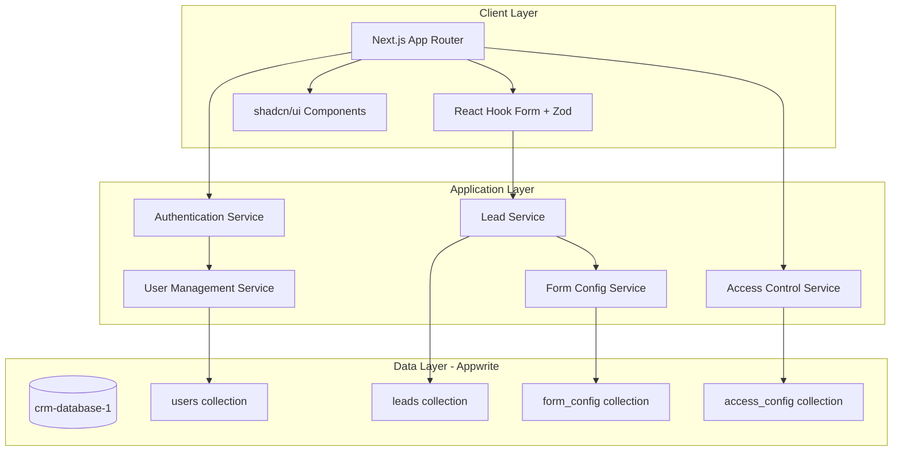
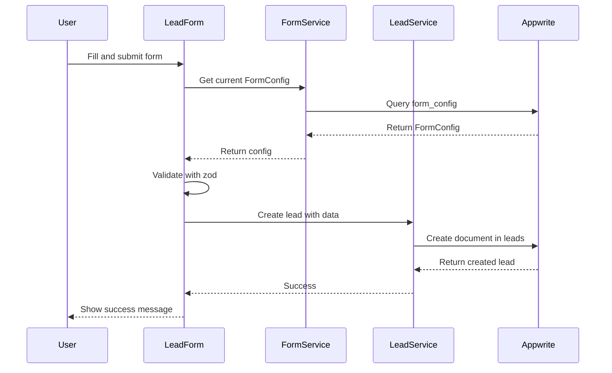
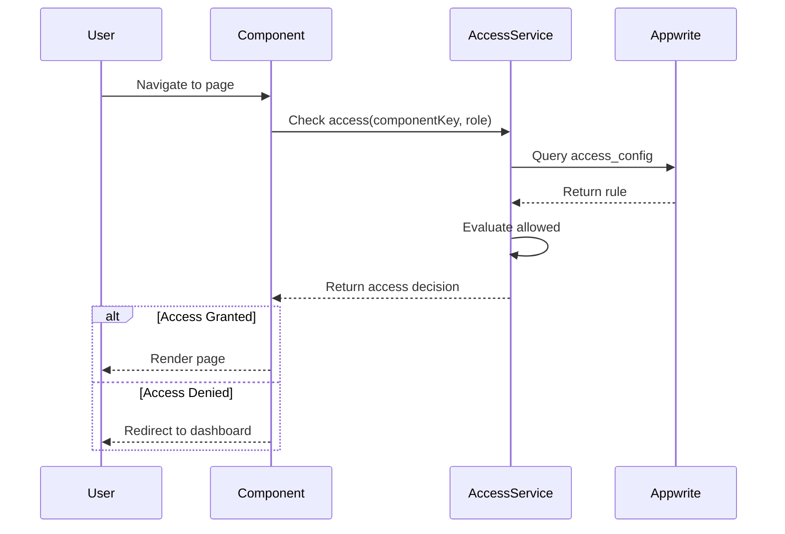

# Design Document: SalesHub CRM

## Overview

SalesHub CRM is a hierarchical customer relationship management system built on Next.js 16 and Appwrite. The architecture emphasizes manager control, dynamic form configuration, and database-level permission enforcement. The system uses a schema-driven approach where managers configure forms and access rules that drive both UI rendering and data validation.

### Key Design Principles

1. **Manager-Controlled Configuration**: All system behavior (forms, access, visibility) is controlled through manager-defined configurations stored in Appwrite
2. **Schema-Driven UI**: Forms and validation are generated dynamically from stored configurations
3. **Database-Level Security**: Permissions enforced at Appwrite collection level, not just application level
4. **Flexible Data Model**: Lead data stored as JSON to support dynamic form configurations without schema migrations
5. **Hierarchical Access**: Clear manager-agent hierarchy with automatic relationship tracking

## Architecture

### System Architecture



### Technology Stack

- **Frontend Framework**: Next.js 16.1.6 (App Router)
- **UI Library**: React 19.2.3
- **Component Library**: shadcn/ui with Radix UI primitives
- **Styling**: Tailwind CSS v4 (dark theme)
- **Form Management**: react-hook-form
- **Validation**: zod
- **Backend/Database**: Appwrite (BaaS)
- **Type Safety**: TypeScript 5

### Deployment Architecture

- **Frontend**: Next.js deployed as server-side rendered application
- **Backend**: Appwrite cloud or self-hosted instance
- **Database**: Appwrite database (crm-database-1)
- **Authentication**: Appwrite Auth with email/password

## Components and Interfaces

### 1. Authentication System

**Purpose**: Manage user authentication and session handling with role-based context.

**Components**:
- `AuthProvider`: React context provider for authentication state
- `useAuth()`: Hook for accessing current user and role
- `LoginPage`: Email/password authentication form
- `SignupPage`: New manager registration form

**Key Interfaces**:

```typescript
interface User {
  $id: string;
  name: string;
  email: string;
  role: 'manager' | 'agent';
  managerId: string | null;
}

interface AuthContext {
  user: User | null;
  isManager: boolean;
  isAgent: boolean;
  login: (email: string, password: string) => Promise<void>;
  logout: () => Promise<void>;
  signup: (name: string, email: string, password: string) => Promise<void>;
}
```

**Authentication Flow**:
1. User submits credentials
2. Appwrite Auth validates and creates session
3. Fetch user document from users collection
4. Store user data and role in context
5. Redirect based on role and access permissions

### 2. User Management Module

**Purpose**: Allow managers to create and manage agent accounts.

**Components**:
- `UserManagementPage`: List of agents with create/edit actions
- `CreateAgentDialog`: Form for creating new agent
- `AgentList`: Table displaying agents linked to current manager

**Key Interfaces**:

```typescript
interface CreateAgentInput {
  name: string;
  email: string;
  password: string;
}

interface Agent extends User {
  role: 'agent';
  managerId: string; // Always set to creating manager
  createdAt: string;
}
```

**Agent Creation Flow**:
1. Manager opens create agent dialog
2. Manager fills name, email, password
3. System creates Appwrite Auth account
4. System creates user document with role='agent' and managerId=currentManager.$id
5. System sets up document-level permissions for the agent
6. Agent appears in manager's agent list

### 3. Access Control System

**Purpose**: Enforce component visibility based on manager-defined rules.

**Components**:
- `AccessControlProvider`: Context provider for access rules
- `useAccess()`: Hook to check component visibility
- `AccessConfigPage`: Manager interface for configuring visibility
- `ProtectedRoute`: Wrapper component that enforces access rules

**Key Interfaces**:

```typescript
interface AccessRule {
  $id: string;
  componentKey: 'dashboard' | 'leads' | 'history' | 'user-management' | 'field-management' | 'settings';
  role: 'manager' | 'agent';
  allowed: boolean;
}

interface AccessConfig {
  rules: AccessRule[];
  canAccess: (componentKey: string, role: string) => boolean;
}
```

**Access Check Flow**:
1. Component requests access check via useAccess()
2. System queries access_config collection for componentKey + role
3. If rule exists, return allowed value
4. If no rule exists, default to: manager=true, agent=false
5. Component renders or redirects based on result

**Visibility Matrix UI**:
- Rows: Component keys (dashboard, leads, history, etc.)
- Columns: Roles (Manager, Agent)
- Cells: Checkboxes (checked=allowed, unchecked=denied)
- Manager column always disabled (always allowed)
- Changes persist immediately to access_config collection

### 4. Form Builder System

**Purpose**: Enable managers to design lead forms without code.

**Components**:
- `FormBuilderPage`: Visual form designer interface
- `FieldList`: Drag-and-drop list of form fields
- `FieldEditor`: Panel for editing field properties
- `FieldTypeSelector`: Dropdown for adding new fields
- `FormPreview`: Live preview of form as agents will see it

**Key Interfaces**:

```typescript
type FieldType = 'text' | 'email' | 'phone' | 'dropdown' | 'textarea' | 'checklist';

interface FormField {
  id: string;
  type: FieldType;
  label: string;
  key: string; // JSON key for storage
  required: boolean;
  visible: boolean;
  order: number;
  options?: string[]; // For dropdown/checklist
  placeholder?: string;
  validation?: {
    pattern?: string;
    minLength?: number;
    maxLength?: number;
  };
}

interface FormConfig {
  $id: string;
  fields: FormField[];
  version: number;
  updatedAt: string;
  updatedBy: string; // Manager ID
}
```

**Default Fields Configuration**:

```typescript
const DEFAULT_FIELDS: FormField[] = [
  { id: '1', type: 'text', label: 'First Name', key: 'firstName', required: true, visible: true, order: 1 },
  { id: '2', type: 'text', label: 'Last Name', key: 'lastName', required: true, visible: true, order: 2 },
  { id: '3', type: 'email', label: 'Email', key: 'email', required: true, visible: true, order: 3 },
  { id: '4', type: 'phone', label: 'Phone', key: 'phone', required: false, visible: true, order: 4 },
  { id: '5', type: 'text', label: 'Company', key: 'company', required: false, visible: true, order: 5 },
  { id: '6', type: 'dropdown', label: 'Source', key: 'source', required: false, visible: true, order: 6,
     options: ['Website', 'Referral', 'Cold Call', 'Social Media'] },
  { id: '7', type: 'dropdown', label: 'Status', key: 'status', required: true, visible: true, order: 7,
     options: ['New', 'Contacted', 'Qualified', 'Proposal', 'Negotiation'] },
  { id: '8', type: 'text', label: 'Owner', key: 'ownerId', required: true, visible: false, order: 8 },
  { id: '9', type: 'text', label: 'Assigned To', key: 'assignedToId', required: false, visible: true, order: 9 },
  { id: '10', type: 'text', label: 'Legal Name', key: 'legalName', required: false, visible: true, order: 10 },
  { id: '11', type: 'text', label: 'SSN (Last 4)', key: 'ssnLast4', required: false, visible: true, order: 11,
     validation: { pattern: '^\\d{4}$', maxLength: 4 } }
 → Updates order of remaining fields
3. **Reorder Fields**: Manager drags field → System updates order property → Re-sorts fields array
4. **Edit Field**: Manager clicks field → Opens editor panel → Manager modifies properties → System updates field object
5. **Toggle Visibility**: Manager clicks eye icon → System toggles visible property
6. **Toggle Required**: Manager clicks asterisk icon → System toggles required property
7. **Edit Dropdown Options**: Manager edits options for dropdown field → System updates options array
8. **Publish Changes**: Manager clicks save → System persists FormConfig to form_config collection → Increments version

**Form Rendering Flow**:
1. Component fetches current FormConfig from form_config collection
2. Filter fields where visible=true (for agents) or all fields (for managers in builder)
3. Sort fields by order property
4. Generate zod schema from field definitions
5. Render form using react-hook-form with generated schema
6. On submit, validate and serialize data as JSON

### 5. Lead Management System

**Purpose**: Manage lead lifecycle from creation through closure and history.

**Components**:
- `LeadsPage`: Active leads list with filters and actions
- `LeadForm`: Dynamic form for creating/editing leads
- `LeadDetailView`: Full lead information display
- `AssignmentSelector`: Dropdown for assigning leads to agents
- `CloseLeadDialog`: Confirmation dialog for closing leads
- `HistoryPage`: Read-only view of closed leads

**Key Interfaces**:

```typescript
interface Lead {
  $id: string;
  data: Record<string, any>; // Dynamic JSON based on FormConfig
  status: string;
  ownerId: string; // Manager ID
  assignedToId: string | null; // Agent ID
  isClosed: boolean;
  createdAt: string;
  closedAt: string | null;
  $permissions: string[]; // Appwrite permissions
}

interface LeadListFilters {
  status?: string;
  assignedToId?: string;
  ownerId?: string;
  dateFrom?: string;
  dateTo?: string;
  searchQuery?: string;
}

interface CreateLeadInput {
  data: Record<string, any>;
  ownerId: string;
  assignedToId?: string;
}
```

**Lead Creation Flow**:
1. User opens lead form
2. System fetches current FormConfig
3. System renders form with visible fields
4. User fills form and submits
5. System validates against zod schema
6. System creates lead document with:
   - data: serialized form values as JSON
   - status: from form or default 'New'
   - ownerId: current manager ID
   - assignedToId: from form or null
   - isClosed: false
   - createdAt: current timestamp
7. System sets document permissions:
   - Read: [ownerId, assignedToId]
   - Update: [ownerId, assignedToId]
   - Delete: [ownerId]
8. Lead appears in Active Leads view

**Lead Assignment Flow**:
1. Manager opens lead detail
2. Manager selects agent from assignment dropdown
3. System updates lead.assignedToId
4. System updates document permissions to include new agent
5. System removes old agent from permissions (if changed)
6. Agent sees lead in their leads list

**Lead Closure Flow**:
1. User clicks close lead button
2. System shows confirmation dialog
3. User confirms closure
4. System updates lead:
   - isClosed: true
   - closedAt: current timestamp
   - status: 'Closed' or user-selected closed status
5. System updates permissions to read-only for agent
6. Lead disappears from Active Leads
7. Lead appears in History view

**Lead Reopen Flow** (Manager only):
1. Manager views lead in History
2. Manager clicks reopen button
3. System updates lead:
   - isClosed: false
   - Preserves closedAt for audit trail
4. System restores update permissions for assigned agent
5. Lead returns to Active Leads view

### 6. History and Audit System

**Purpose**: Provide permanent, filterable record of all closed leads.

**Components**:
- `HistoryPage`: List of closed leads with filters
- `HistoryFilters`: Date range, agent, status filters
- `HistoryDetailView`: Read-only lead detail view
- `ReopenLeadButton`: Manager-only button to reopen leads

**Key Interfaces**:

```typescript
interface HistoryFilters {
  dateFrom?: string;
  dateTo?: string;
  agentId?: string;
  status?: string;
  closedBy?: string;
}

interface HistoryEntry extends Lead {
  isClosed: true;
  closedAt: string; // Always present for history entries
}
```

**History Query Flow**:
1. User navigates to History page
2. System queries leads collection where isClosed=true
3. Apply role-based filtering:
   - Manager: All closed leads they own
   - Agent: Only closed leads they were assigned to
4. Apply user-selected filters (date, agent, status)
5. Sort by closedAt descending (most recent first)
6. Render read-only list

**History Detail View**:
- Display all lead data fields (even hidden ones)
- Show closure metadata (closedAt, closedBy)
- Show full audit trail if available
- Disable all form inputs
- Show reopen button only for managers

## Data Models

### Appwrite Database: crm-database-1

#### Collection: users

**Purpose**: Store user accounts with role and hierarchy information.

**Attributes**:
- `$id`: string (auto-generated)
- `name`: string (required, max 255)
- `email`: string (required, unique, max 255)
- `role`: string (required, enum: ['manager', 'agent'])
- `managerId`: string (nullable, relationship to users.$id)
- `createdAt`: datetime (auto)

**Indexes**:
- `email_idx`: unique index on email
- `role_idx`: index on role
- `manager_idx`: index on managerId

**Permissions**:
- Create: Public (for signup) + Managers (for agent creation)
- Read: User (own document) + Manager (their agents)
- Update: User (own document) + Manager (their agents)
- Delete: Manager (their agents only)

#### Collection: leads

**Purpose**: Store lead data with dynamic schema support.

**Attributes**:
- `$id`: string (auto-generated)
- `data`: string (required, JSON serialized, max 65535)
- `status`: string (required, max 50)
- `ownerId`: string (required, relationship to users.$id)
- `assignedToId`: string (nullable, relationship to users.$id)
- `isClosed`: boolean (required, default false)
- `createdAt`: datetime (auto)
- `closedAt`: datetime (nullable)

**Indexes**:
- `owner_idx`: index on ownerId
- `assigned_idx`: index on assignedToId
- `status_idx`: index on status
- `closed_idx`: index on isClosed
- `created_idx`: index on createdAt
- `composite_active_idx`: composite index on (isClosed, ownerId, assignedToId)

**Permissions** (Document-level, set dynamically):
- Read: [ownerId, assignedToId]
- Update: [ownerId] + [assignedToId] (if not closed)
- Delete: [ownerId]

**JSON Data Structure** (stored in data field):
```json
{
  "firstName": "John",
  "lastName": "Doe",
  "email": "john@example.com",
  "phone": "+1234567890",
  "company": "Acme Corp",
  "source": "Website",
  "status": "New",
  "legalName": "John Michael Doe",
  "ssnLast4": "1234",
  "visaStatus": "Citizen",
  "notes": "Interested in enterprise plan"
}
```

#### Collection: form_config

**Purpose**: Store manager-defined form configurations.

**Attributes**:
- `$id`: string (auto-generated, use 'current' as singleton ID)
- `fields`: string (required, JSON serialized array of FormField)
- `version`: number (required, incremented on each update)
- `updatedAt`: datetime (auto)
- `updatedBy`: string (required, manager user ID)

**Indexes**:
- `version_idx`: index on version

**Permissions**:
- Create: Managers only
- Read: All authenticated users
- Update: Managers only
- Delete: Managers only

**Singleton Pattern**: Use fixed document ID 'current' to maintain single active configuration.

#### Collection: access_config

**Purpose**: Store component visibility rules.

**Attributes**:
- `$id`: string (auto-generated)
- `componentKey`: string (required, max 50)
- `role`: string (required, enum: ['manager', 'agent'])
- `allowed`: boolean (required, default false)

**Indexes**:
- `component_role_idx`: unique composite index on (componentKey, role)

**Permissions**:
- Create: Managers only
- Read: All authenticated users
- Update: Managers only
- Delete: Managers only

**Default Rules** (seed data):
```json
[
  { "componentKey": "dashboard", "role": "agent", "allowed": true },
  { "componentKey": "leads", "role": "agent", "allowed": true },
  { "componentKey": "history", "role": "agent", "allowed": false },
  { "componentKey": "user-management", "role": "agent", "allowed": false },
  { "componentKey": "field-management", "role": "agent", "allowed": false },
  { "componentKey": "settings", "role": "agent", "allowed": false }
]
```

### Data Flow Diagrams

#### Lead Creation Data Flow



#### Access Control Data Flow



## Correctness Properties

*A property is a characteristic or behavior that should hold true across all valid executions of a system—essentially, a formal statement about what the system should do. Properties serve as the bridge between human-readable specifications and machine-verifiable correctness guarantees.*

### Property 1: User Role Constraint

*For any* user in the system, the role field must be either 'manager' or 'agent', and no other values are permitted.

**Validates: Requirements 1.1**

### Property 2: Agent Creation Sets Role and Manager Link

*For any* user created through User Management by a manager, the created user must have role='agent' and managerId set to the creating manager's ID.

**Validates: Requirements 1.3, 1.5, 8.2, 8.3**

### Property 3: Default User Creation Assigns Manager Role

*For any* user created through signup or direct creation outside User Management, the user must have role='manager' and managerId=null.

**Validates: Requirements 1.2, 12.1, 12.2, 12.3**

### Property 4: Access Config Persistence Round-Trip

*For any* valid access configuration changes made by a manager, saving and then retrieving the configuration must produce an equivalent configuration.

**Validates: Requirements 2.2**

### Property 5: Agent Component Visibility Enforcement

*For any* agent user and any set of access rules, the components visible to that agent must exactly match those where allowed=true for the agent role.

**Validates: Requirements 2.4, 10.8**

### Property 6: Manager Full Component Access

*For any* manager user and any access configuration, all system components must be visible and accessible regardless of access rules.

**Validates: Requirements 2.5**

### Property 7: Form Config Field Operations

*For any* form configuration, adding a field, removing a field, or reordering fields must result in a valid form configuration that persists correctly.

**Validates: Requirements 3.2**

### Property 8: Field Visibility Filtering for Agents

*For any* form configuration, when an agent views the lead form, only fields where visible=true must be rendered.

**Validates: Requirements 3.8**

### Property 9: Required Field Validation Enforcement

*For any* form configuration with required fields, submitting a lead form with missing required fields must fail validation.

**Validates: Requirements 3.9, 11.1**

### Property 10: Form Config Persistence Round-Trip

*For any* valid form configuration changes, publishing the changes and then retrieving the configuration must produce an equivalent configuration with incremented version.

**Validates: Requirements 3.7**

### Property 11: Lead Data JSON Serialization Round-Trip

*For any* valid lead data object, serializing to JSON, storing, retrieving, and deserializing must produce an equivalent object.

**Validates: Requirements 3.10, 9.5, 9.6**

### Property 12: Lead Closure State Transition

*For any* active lead, when closed, the lead must have isClosed=true, closedAt timestamp set, and must no longer appear in Active Leads view.

**Validates: Requirements 4.3, 4.4, 4.5**

### Property 13: Lead Reopen Preserves History

*For any* closed lead that is reopened by a manager, the lead must return to Active state while preserving the original closedAt timestamp.

**Validates: Requirements 4.7, 7.6**

### Property 14: Agent Lead Visibility Restriction

*For any* agent user, the leads visible to that agent must be exactly the set of leads where the agent is the assignedToId.

**Validates: Requirements 5.4, 6.2**

### Property 15: Manager Lead Visibility

*For any* manager user, all leads where the manager is the owner must be visible regardless of assignment.

**Validates: Requirements 5.5, 6.4**

### Property 16: Lead Assignment Permission Update

*For any* lead reassignment from one agent to another, the document permissions must be updated to grant access to the new agent and revoke update access from the old agent.

**Validates: Requirements 5.2, 6.2, 6.3**

### Property 17: Closed Lead Read-Only Enforcement

*For any* closed lead, agents must have read-only access and cannot modify the lead data.

**Validates: Requirements 4.6, 6.3**

### Property 18: History Filtering Correctness

*For any* history query with filters (date, agent, status), all returned leads must match all specified filter criteria and have isClosed=true.

**Validates: Requirements 7.3, 7.4**

### Property 19: Email Format Validation

*For any* form field with type='email', submitting invalid email formats must fail validation.

**Validates: Requirements 11.2**

### Property 20: Phone Format Validation

*For any* form field with type='phone', submitting invalid phone number formats must fail validation.

**Validates: Requirements 11.3**

### Property 21: Dropdown Options Constraint

*For any* dropdown field in a submitted lead form, the submitted value must be one of the configured options for that field.

**Validates: Requirements 3.6**

## Error Handling

### Authentication Errors

**Invalid Credentials**:
- Display: "Invalid email or password" message
- Action: Clear password field, keep email populated
- Logging: Log failed attempt with email (not password)

**Session Expiration**:
- Detection: Appwrite SDK throws 401 error
- Action: Clear auth context, redirect to login
- Display: "Your session has expired. Please log in again."

**Network Errors**:
- Display: "Unable to connect. Please check your internet connection."
- Action: Retry button, maintain form state
- Logging: Log network error details

### Form Validation Errors

**Required Field Missing**:
- Display: Red border on field, inline error message
- Message: "[Field name] is required"
- Prevention: Disable submit button until valid

**Invalid Format**:
- Display: Inline error below field
- Messages:
  - Email: "Please enter a valid email address"
  - Phone: "Please enter a valid phone number"
  - SSN: "Please enter exactly 4 digits"

**Dropdown Invalid Selection**:
- Prevention: Use controlled select components
- Fallback: If invalid value detected, show "Please select a valid option"

### Permission Errors

**Unauthorized Access Attempt**:
- Detection: Appwrite returns 403 or document not found
- Action: Redirect to dashboard
- Display: Toast notification "You don't have permission to access this resource"
- Logging: Log unauthorized attempt with user ID and resource

**Agent Attempting Manager Action**:
- Prevention: Hide UI elements for unauthorized actions
- Fallback: If API called directly, return 403
- Display: "This action requires manager permissions"

### Data Integrity Errors

**Lead Assignment to Non-Existent Agent**:
- Validation: Check agent exists before assignment
- Error: "Selected agent not found"
- Action: Refresh agent list, prompt re-selection

**Form Config Version Conflict**:
- Detection: Version mismatch on save
- Action: Fetch latest version, show diff
- Display: "Form configuration was updated by another user. Please review changes."
- Resolution: Merge or overwrite options

**JSON Serialization Failure**:
- Detection: JSON.stringify throws error
- Logging: Log full error with data structure
- Display: "Unable to save lead data. Please contact support."
- Fallback: Preserve form state for retry

### Database Errors

**Connection Failure**:
- Detection: Appwrite SDK timeout or network error
- Display: "Unable to connect to database. Retrying..."
- Action: Exponential backoff retry (3 attempts)
- Fallback: Show offline mode message

**Document Not Found**:
- Scenario: Lead deleted by another user
- Display: "This lead no longer exists"
- Action: Remove from local cache, redirect to leads list

**Unique Constraint Violation**:
- Scenario: Duplicate email on user creation
- Display: "A user with this email already exists"
- Action: Highlight email field, suggest login

### UI Error Boundaries

**Component Crash**:
- Boundary: Wrap each major route in ErrorBoundary
- Display: Friendly error message with reload button
- Logging: Send error stack to logging service
- Fallback: Show minimal UI to navigate away

**Form Rendering Error**:
- Scenario: Invalid FormConfig structure
- Display: "Unable to load form. Using default configuration."
- Action: Load DEFAULT_FIELDS as fallback
- Logging: Log invalid config for admin review

## Testing Strategy

### Dual Testing Approach

The testing strategy combines unit tests for specific examples and edge cases with property-based tests for universal correctness properties. Both approaches are complementary and necessary for comprehensive coverage.

**Unit Tests**: Focus on specific examples, integration points, and edge cases
**Property Tests**: Verify universal properties across randomized inputs (minimum 100 iterations per test)

### Property-Based Testing Configuration

**Library**: fast-check (for TypeScript/JavaScript)

**Configuration**:
```typescript
import fc from 'fast-check';

// Minimum 100 iterations per property test
const testConfig = { numRuns: 100 };

// Tag format for traceability
// Feature: saleshub-crm, Property {number}: {property_text}
```

**Each correctness property from the design document must be implemented as a single property-based test.**

### Test Organization

```
tests/
├── unit/
│   ├── auth/
│   │   ├── login.test.ts
│   │   ├── signup.test.ts
│   │   └── session.test.ts
│   ├── forms/
│   │   ├── form-builder.test.ts
│   │   ├── form-rendering.test.ts
│   │   └── validation.test.ts
│   ├── leads/
│   │   ├── lead-creation.test.ts
│   │   ├── lead-assignment.test.ts
│   │   ├── lead-closure.test.ts
│   │   └── lead-filtering.test.ts
│   ├── access/
│   │   ├── component-visibility.test.ts
│   │   └── permission-enforcement.test.ts
│   └── users/
│       ├── agent-creation.test.ts
│       └── role-assignment.test.ts
├── property/
│   ├── user-properties.test.ts
│   ├── access-properties.test.ts
│   ├── form-properties.test.ts
│   ├── lead-properties.test.ts
│   └── validation-properties.test.ts
└── integration/
    ├── lead-lifecycle.test.ts
    ├── user-management-flow.test.ts
    └── form-builder-flow.test.ts
```

### Unit Test Examples

**Authentication**:
- Login with valid credentials succeeds
- Login with invalid credentials fails
- Signup creates manager account
- Session persists across page refresh
- Logout clears session

**Form Builder**:
- Adding a field updates form config
- Removing a field updates form config
- Reordering fields updates order property
- Toggling visibility updates visible property
- Publishing increments version number

**Lead Management**:
- Creating lead with valid data succeeds
- Creating lead with missing required fields fails
- Assigning lead to agent updates permissions
- Closing lead sets isClosed and closedAt
- Reopening lead restores active state

**Access Control**:
- Agent cannot access restricted components
- Manager can access all components
- Access rules persist correctly
- Default rules apply when no custom rules exist

### Property-Based Test Examples

**Property 1: User Role Constraint**
```typescript
// Feature: saleshub-crm, Property 1: User role must be 'manager' or 'agent'
fc.assert(
  fc.property(
    fc.record({
      name: fc.string(),
      email: fc.emailAddress(),
      role: fc.constantFrom('manager', 'agent'),
      managerId: fc.option(fc.uuid(), { nil: null })
    }),
    (user) => {
      const created = createUser(user);
      return created.role === 'manager' || created.role === 'agent';
    }
  ),
  { numRuns: 100 }
);
```

**Property 9: Required Field Validation**
```typescript
// Feature: saleshub-crm, Property 9: Required fields must be validated
fc.assert(
  fc.property(
    fc.array(fc.record({
      key: fc.string(),
      required: fc.boolean(),
      type: fc.constantFrom('text', 'email', 'phone')
    })),
    fc.dictionary(fc.string(), fc.string()),
    (fields, data) => {
      const requiredFields = fields.filter(f => f.required);
      const missingRequired = requiredFields.some(f => !data[f.key]);
      const result = validateForm(fields, data);

      if (missingRequired) {
        return !result.valid;
      }
      return true;
    }
  ),
  { numRuns: 100 }
);
```

**Property 11: JSON Serialization Round-Trip**
```typescript
// Feature: saleshub-crm, Property 11: Lead data serialization round-trip
fc.assert(
  fc.property(
    fc.dictionary(fc.string(), fc.anything()),
    (leadData) => {
      const serialized = JSON.stringify(leadData);
      const deserialized = JSON.parse(serialized);
      return JSON.stringify(deserialized) === serialized;
    }
  ),
  { numRuns: 100 }
);
```

**Property 14: Agent Lead Visibility**
```typescript
// Feature: saleshub-crm, Property 14: Agent sees only assigned leads
fc.assert(
  fc.property(
    fc.uuid(), // agentId
    fc.array(fc.record({
      $id: fc.uuid(),
      assignedToId: fc.option(fc.uuid(), { nil: null }),
      ownerId: fc.uuid()
    })),
    (agentId, allLeads) => {
      const visibleLeads = filterLeadsForAgent(agentId, allLeads);
      return visibleLeads.every(lead => lead.assignedToId === agentId);
    }
  ),
  { numRuns: 100 }
);
```

### Integration Test Scenarios

**Complete Lead Lifecycle**:
1. Manager creates lead
2. Manager assigns lead to agent
3. Agent views and edits lead
4. Agent closes lead
5. Lead appears in history
6. Manager reopens lead
7. Lead returns to active state

**User Management Flow**:
1. Manager signs up (becomes manager)
2. Manager creates agent account
3. Agent logs in
4. Agent sees only permitted components
5. Manager updates access rules
6. Agent's view updates accordingly

**Form Builder Flow**:
1. Manager opens form builder
2. Manager adds custom field
3. Manager publishes changes
4. Agent creates lead with new form
5. New field data persists correctly
6. Manager hides field
7. Agent no longer sees field

### Test Data Generators

**User Generator**:
```typescript
const userArb = fc.record({
  name: fc.string({ minLength: 1, maxLength: 255 }),
  email: fc.emailAddress(),
  role: fc.constantFrom('manager', 'agent'),
  managerId: fc.option(fc.uuid(), { nil: null })
});
```

**Lead Generator**:
```typescript
const leadArb = fc.record({
  data: fc.dictionary(fc.string(), fc.anything()),
  status: fc.constantFrom('New', 'Contacted', 'Qualified', 'Proposal'),
  ownerId: fc.uuid(),
  assignedToId: fc.option(fc.uuid(), { nil: null }),
  isClosed: fc.boolean()
});
```

**FormField Generator**:
```typescript
const formFieldArb = fc.record({
  id: fc.uuid(),
  type: fc.constantFrom('text', 'email', 'phone', 'dropdown', 'textarea'),
  label: fc.string({ minLength: 1, maxLength: 100 }),
  key: fc.string({ minLength: 1, maxLength: 50 }),
  required: fc.boolean(),
  visible: fc.boolean(),
  order: fc.integer({ min: 0, max: 100 }),
  options: fc.option(fc.array(fc.string()), { nil: undefined })
});
```

### Mocking Strategy

**Appwrite SDK Mocking**:
- Mock Appwrite client for unit tests
- Use test database for integration tests
- Mock authentication for component tests

**Example Mock**:
```typescript
const mockAppwrite = {
  account: {
    create: jest.fn(),
    createEmailSession: jest.fn(),
    get: jest.fn(),
    deleteSession: jest.fn()
  },
  databases: {
    createDocument: jest.fn(),
    getDocument: jest.fn(),
    listDocuments: jest.fn(),
    updateDocument: jest.fn(),
    deleteDocument: jest.fn()
  }
};
```

### Test Coverage Goals

- **Unit Test Coverage**: Minimum 80% line coverage
- **Property Test Coverage**: All 21 correctness properties implemented
- **Integration Test Coverage**: All major user flows covered
- **Edge Case Coverage**: All error conditions tested

### Continuous Integration

**Pre-commit**:
- Run unit tests
- Run linter
- Type checking

**CI Pipeline**:
- Run all unit tests
- Run all property tests (100 iterations each)
- Run integration tests
- Generate coverage report
- Fail if coverage below 80%

### Performance Testing

**Load Testing Scenarios**:
- 100 concurrent users creating leads
- 1000 leads in database, filter performance
- Form config with 50+ fields rendering time
- History view with 10,000+ closed leads

**Performance Targets**:
- Lead creation: < 500ms
- Lead list loading: < 1s for 100 leads
- Form rendering: < 200ms
- Access check: < 50ms

### Security Testing

**Permission Testing**:
- Verify agent cannot access manager endpoints
- Verify agent cannot see unassigned leads
- Verify closed leads are read-only for agents
- Verify document-level permissions enforced

**Input Validation Testing**:
- SQL injection attempts (N/A for Appwrite, but test input sanitization)
- XSS attempts in form fields
- Malformed JSON in lead data
- Oversized payloads

**Authentication Testing**:
- Session hijacking prevention
- CSRF protection
- Password strength requirements
- Rate limiting on login attempts
