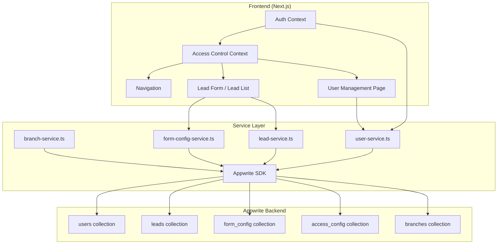

# Design Document: Team Lead Role Hierarchy

## Overview

This design introduces the `team_lead` role into the SalesHub CRM, extending the hierarchy to Admin → Manager → Team Lead → Agent. The change touches the Appwrite database schema, TypeScript types, service layer, auth/access contexts, lead form logic, and user management UI. The core principle is that each level in the hierarchy can only delegate branches it already possesses, and data visibility is scoped to the user's assigned branches.

## Architecture

The system follows a Next.js client-side architecture with Appwrite as the backend. Changes span these layers:



### Key Design Decisions

1. **branchIds as string array**: Appwrite supports array attributes. We add `branchIds` as a new string array field rather than modifying the existing `branchId` string field, allowing a migration period. The old `branchId` field can be deprecated after migration.

2. **teamLeadId on users**: Agents get a `teamLeadId` field pointing to their Team Lead. This enables querying agents by team lead. The existing `managerId` field on agents is preserved and set to the Team Lead's managerId (the Manager above them), maintaining the full chain.

3. **Branch subset validation in service layer**: The constraint that a creator can only assign branches they own is enforced in the service functions (`createTeamLead`, `createAgent`), not at the database level, since Appwrite doesn't support cross-document validation rules.

4. **Dynamic Assigned To dropdown**: Instead of a static form field, the Assigned To selection is rendered as a role-aware dropdown component that queries eligible users based on the creator's role and branches. Owner and Assigned To are removed from `Form_Config` (DEFAULT_FIELDS).

## Components and Interfaces

### Modified: `lib/types/index.ts`

```typescript
// Updated role type
export type UserRole = 'admin' | 'manager' | 'team_lead' | 'agent';

// Updated User interface
export interface User {
  $id: string;
  name: string;
  email: string;
  role: UserRole;
  managerId: string | null;
  teamLeadId: string | null;
  branchIds: string[];
  // Deprecated - kept for migration compatibility
  branchId?: string | null;
  $createdAt?: string;
  $updatedAt?: string;
}

// New input type
export interface CreateTeamLeadInput {
  name: string;
  email: string;
  password: string;
  managerId: string;
  branchIds: string[];
}

// Updated agent input
export interface CreateAgentInput {
  name: string;
  email: string;
  password: string;
  teamLeadId: string;
  branchIds: string[];
}

// Updated auth context
export interface AuthContext {
  user: User | null;
  isAdmin: boolean;
  isManager: boolean;
  isTeamLead: boolean;
  isAgent: boolean;
  loading: boolean;
  login: (email: string, password: string) => Promise<void>;
  logout: () => Promise<void>;
  signup: (name: string, email: string, password: string) => Promise<void>;
}
```

### Modified: `lib/services/user-service.ts`

New and updated functions:

```typescript
// New function
export async function createTeamLead(input: CreateTeamLeadInput): Promise<User>
// - Validates input.branchIds ⊆ manager.branchIds
// - Creates Appwrite auth account
// - Creates user doc with role='team_lead', managerId, branchIds

// Updated function
export async function createAgent(input: CreateAgentInput): Promise<User>
// - Now takes teamLeadId instead of managerId
// - Validates input.branchIds ⊆ teamLead.branchIds
// - Sets managerId = teamLead.managerId, teamLeadId = input.teamLeadId

// New function
export async function getAssignableUsers(
  creatorRole: UserRole,
  creatorBranchIds: string[]
): Promise<User[]>
// - Manager: returns team_leads + agents with overlapping branchIds
// - Team Lead: returns agents with overlapping branchIds
// - Agent: returns empty array

// Updated function
export async function getUsersByBranch(branchId: string): Promise<User[]>
// - Updated to query branchIds array (contains) instead of branchId equality

// New function
export async function getUsersByBranches(branchIds: string[]): Promise<User[]>
// - Returns all users whose branchIds overlap with the given array
```

### Modified: `lib/contexts/auth-context.tsx`

```typescript
// Add isTeamLead helper
const isTeamLead = user?.role === 'team_lead';

// Update isManager to NOT include admin (breaking change fix)
// Currently: isManager = user?.role === 'manager' || user?.role === 'admin'
// New: isManager = user?.role === 'manager'
// Admin check remains separate via isAdmin

// Update fetchUserDocument to map branchIds and teamLeadId
```

### Modified: `lib/contexts/access-control-context.tsx`

```typescript
// Update AccessRule type to include team_lead
interface AccessRule {
  componentKey: ComponentKey;
  role: 'manager' | 'team_lead' | 'agent';
  allowed: boolean;
}

// Update canAccess default rules for team_lead:
// team_lead: dashboard, leads, history, user-management = true
// team_lead: field-management, settings, branch-management = false
```

### Modified: `lib/services/lead-service.ts`

```typ

```typescript
// Remove fields with id='8' (Owner/ownerId) and id='9' (Assigned To/assignedToId)
// from DEFAULT_FIELDS array
```

### New: Lead Assignment Dropdown Component

```typescript
// components/lead-assignment-dropdown.tsx
interface LeadAssignmentDropdownProps {
  creatorRole: UserRole;
  creatorBranchIds: string[];
  value: string | null;
  onChange: (userId: string | null) => void;
}
// Fetches assignable users via getAssignableUsers()
// Renders a select dropdown with user names
// Hidden for agents (they auto-own their leads)
```

### Modified: `app/users/page.tsx`

The user management page is updated to support creating Team Leads (by Managers) and Agents (by Team Leads), with branch selection restricted to the creator's branches.

## Data Models

### Users Collection (Appwrite)

| Attribute   | Type          | Required | Description                                      |
|-------------|---------------|----------|--------------------------------------------------|
| name        | string        | yes      | User's display name                              |
| email       | email         | yes      | User's email address                             |
| role        | enum          | yes      | One of: admin, manager, team_lead, agent         |
| managerId   | string        | no       | ID of the user's manager (for team_leads and agents) |
| teamLeadId  | string        | no       | ID of the agent's team lead (agents only)        |
| branchIds   | string[]      | no       | Array of assigned branch IDs                     |
| branchId    | string        | no       | Deprecated single branch (kept for migration)    |

### Leads Collection (Appwrite)

| Attribute     | Type     | Required | Description                                |
|---------------|----------|----------|--------------------------------------------|
| data          | string   | yes      | JSON-serialized lead data                  |
| status        | string   | yes      | Lead status (New, Contacted, etc.)         |
| ownerId       | string   | yes      | ID of the user who created the lead        |
| assignedToId  | string   | no       | ID of the user the lead is assigned to     |
| branchId      | string   | no       | Branch the lead belongs to                 |
| isClosed      | boolean  | yes      | Whether the lead is closed                 |
| closedAt      | datetime | no       | When the lead was closed                   |

### Access Config Collection (Appwrite)

| Attribute    | Type    | Required | Description                                    |
|--------------|---------|----------|------------------------------------------------|
| componentKey | string  | yes      | UI component identifier                        |
| role         | enum    | yes      | One of: admin, manager, team_lead, agent       |
| allowed      | boolean | yes      | Whether the role can access the component      |


## Correctness Properties

*A property is a characteristic or behavior that should hold true across all valid executions of a system — essentially, a formal statement about what the system should do. Properties serve as the bridge between human-readable specifications and machine-verifiable correctness guarantees.*

### Property 1: Role validation

*For any* string value, the role validation function SHALL accept it if and only if it is one of 'admin', 'manager', 'team_lead', or 'agent'. All other strings SHALL be rejected.

**Validates: Requirements 1.1, 1.2**

### Property 2: isTeamLead helper correctness

*For any* User object, the `isTeamLead` computed property SHALL return `true` if and only if `user.role === 'team_lead'`, and `false` for all other role values.

**Validates: Requirements 1.3**

### Property 3: Branch array storage round-trip

*For any* non-empty array of valid branch IDs assigned to a user during creation, reading that user back SHALL return a `branchIds` array containing exactly the same set of branch IDs.

**Validates: Requirements 2.1, 2.2**

### Property 4: Branch query filtering

*For any* branch ID and any set of users with various branchIds arrays, querying users by that branch ID SHALL return exactly the users whose branchIds array contains that branch ID, and no others.

**Validates: Requirements 2.3**

### Property 5: Branch subset validation on user creation

*For any* creator (Manager or Team_Lead) with branchIds `B_creator`, and any set of branch IDs `B_target` to assign to a new subordinate: if `B_target ⊆ B_creator`, the creation SHALL succeed and the new user's branchIds SHALL equal `B_target`; if `B_target ⊄ B_creator` (contains at least one branch not in `B_creator`), the creation SHALL be rejected with an error.

**Validates: Requirements 3.2, 3.3, 3.4**

### Property 6: Hierarchy chain correctness

*For any* Manager creating a Team_Lead, the Team_Lead's `managerId` SHALL equal the Manager's user ID. *For any* Team_Lead creating an Agent, the Agent's `teamLeadId` SHALL equal the Team_Lead's user ID and the Agent's `managerId` SHALL equal the Team_Lead's `managerId`.

**Validates: Requirements 3.5, 3.6**

### Property 7: Auto-ownership on lead creation

*For any* user creating a lead, the resulting lead's `ownerId` SHALL equal the creating user's ID, regardless of the user's role.

**Validates: Requirements 4.1**

### Property 8: Assignable users filtering

*For any* user with role and branchIds, `getAssignableUsers` SHALL return: for a Manager — only users with role `team_lead` or `agent` whose branchIds overlap with the Manager's branchIds; for a Team_Lead — only users with role `agent` whose branchIds overlap with the Team_Lead's branchIds; for an Agent — an empty array.

**Validates: Requirements 4.2, 4.3, 4.4**

### Property 9: Lead visibility scoping

*For any* set of leads across branches and any querying user: if the user is Admin, all leads SHALL be returned; if the user is Manager or Team_Lead, only leads whose `branchId` is in the user's `branchIds` SHALL be returned; if the user is Agent, only leads whose `assignedToId` equals the user's ID SHALL be returned.

**Validates: Requirements 5.1, 5.2, 5.3, 5.4**

### Property 10: User visibility scoping

*For any* set of users across branches and any querying user with role Manager or Team_Lead, only users whose `branchIds` array has at least one element in common with the querying user's `branchIds` SHALL be returned.

**Validates: Requirements 5.5, 5.6**

### Property 11: Navigation filtering by access rules

*For any* set of access rules and a user with role `team_lead`, the visible navigation items SHALL be exactly those components where `canAccess(component, 'team_lead')` returns `true`.

**Validates: Requirements 6.4**

## Error Handling

| Scenario | Error Response | Handling |
|----------|---------------|----------|
| Branch not in creator's branchIds | `"Branch {branchId} is not in your assigned branches"` | Reject creation, return 400-level error |
| Invalid role value on user creation | `"Invalid role: must be admin, manager, team_lead, or agent"` | Reject creation, return validation error |
| Team Lead tries to access field-management | Access denied via `canAccess()` returning false | Navigation hides the item; direct URL access shows "Access Denied" |
| Agent tries to create another user | Access denied via role check in user-service | Return `"Agents cannot create users"` error |
| Empty branchIds array on team lead/agent creation | `"At least one branch must be assigned"` | Reject creation with validation error |
| Team Lead's manager not found (orphaned teamLeadId) | `"Manager not found for team lead"` | Log error, return 404-level error |
| Migration fails for a user document | Log the failed document ID and continue | Partial migration with error report |

## Testing Strategy

### Property-Based Testing

The project already uses `fast-check` (present in `node_modules/fast-check`). All property tests go in `tests/property/`.

Each property test:
- Runs a minimum of 100 iterations
- References its design property with a tag comment
- Uses `fast-check` arbitraries to generate random inputs

**Property tests to implement:**

1. **Property 1** (Role validation): Generate random strings, verify only the four valid roles pass validation
2. **Property 5** (Branch subset validation): Generate random creator branchIds and target branchIds, verify subset logic
3. **Property 6** (Hierarchy chain): Generate random creator/subordinate pairs, verify managerId/teamLeadId chain
4. **Property 7** (Auto-ownership): Generate random users and lead data, verify ownerId is set to creator
5. **Property 8** (Assignable users filtering): Generate random user sets with various roles/branches, verify filtering
6. **Property 9** (Lead visibility scoping): Generate random leads across branches and querying users, verify filtering
7. **Property 10** (User visibility scoping): Generate random user sets, verify branch overlap filtering

### Unit Testing

Unit tests go in `tests/unit/` and focus on specific examples and edge cases:

- **isTeamLead helper** (Property 2): Verify for each of the four roles
- **Branch array storage** (Property 3): Verify single and multi-branch assignment
- **DEFAULT_FIELDS removal**: Verify ownerId and assignedToId fields are absent
- **Access control for team_lead**: Verify allowed/denied components match spec
- **Migration script**: Verify branchId → branchIds conversion for existing users
- **Navigation filtering** (Property 11): Verify visible items for team_lead role

### Test Configuration

- Framework: Jest (existing `jest.config.js`)
- Property testing: fast-check
- Minimum iterations: 100 per property test
- Tag format: `Feature: team-lead-role-hierarchy, Property {N}: {title}`
