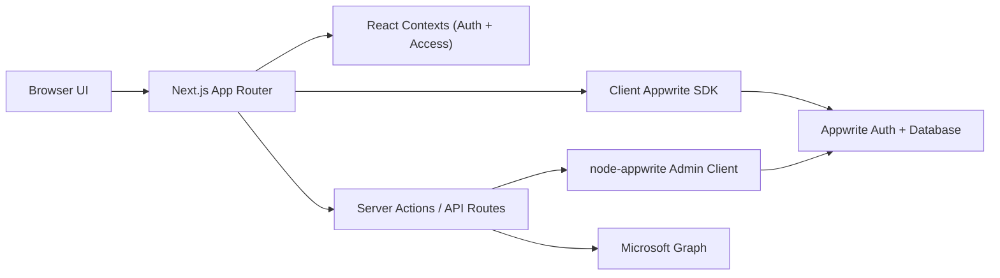

# System Overview

## What This Project Is

NewPulse CRM is a Next.js App Router application for managing sales leads, user hierarchy, branch access, and email-based support workflows. It uses Appwrite as the main backend for authentication, database storage, and document permissions.

The system is not only a lead tracker. It also includes:

- Hierarchical user management.
- Dynamic lead form configuration.
- Role-based navigation and route access.
- Audit logging.
- Branch management.
- Outlook-powered mock interview, assessment support, and interview support mail flows.

## Core Business Areas

### 1. CRM Lead Management

Users can:

- Create leads.
- Assign leads.
- Edit leads.
- Close leads into client history.
- Reopen closed leads.

Lead payloads are stored as JSON in Appwrite, which allows the form to be configurable without schema changes for every field.

### 2. User Hierarchy Management

The user model supports this hierarchy:

- `admin`
- `manager`
- `assistant_manager`
- `team_lead`
- `agent`

The implementation supports both legacy single-manager fields and newer multi-manager arrays:

- `managerId`
- `managerIds`
- `assistantManagerId`
- `assistantManagerIds`
- `teamLeadId`

### 3. Branch-Based Organization

Users can be linked to one or more branches through `branchIds`. Leads can also carry a `branchId`.

Branch data is used for:

- Scoping user creation.
- Scoping assignable users.
- Lead visibility for some roles.
- Dashboard and reporting context.

### 4. Dynamic Form Builder

Managers can modify the lead capture form at runtime. The app stores the current form definition in Appwrite and builds a Zod schema dynamically for validation.

### 5. Access Control

There are two layers of access:

- Page/component visibility through access rules stored in Appwrite and exposed through React context.
- Appwrite document permissions for user and lead documents.

### 6. Outlook-Based Support Workflows

The application can send three types of Microsoft Graph emails:

- Mock interview emails.
- Sales assessment support emails.
- Sales interview support emails.

These features depend on Azure authentication and Outlook access tokens stored in HTTP-only cookies.

## Technology Stack

### Frontend

- Next.js 16 App Router
- React 19
- TypeScript
- Tailwind CSS v4
- shadcn/ui style component primitives
- React Hook Form
- Zod
- Recharts

### Backend And Integrations

- Appwrite Web SDK for client-side auth and data access
- `node-appwrite` for privileged server-side actions
- Azure MSAL
- Microsoft Graph `sendMail`
- Sentry for error monitoring

### Testing

- Jest + Testing Library
- Fast-check property tests
- A Vitest config also exists, but Jest is the primary runner wired in `package.json`

## High-Level Runtime Flow

## Main Product Surfaces

- Dashboard
- Leads
- Client history
- User management
- Branch management
- Field management
- Access settings
- Audit logs
- Hierarchy
- Mock interview support
- Assessment support
- Interview support

## Important Design Characteristics

### Dynamic Data Instead Of Rigid Lead Columns

Lead details are not modeled as many fixed Appwrite attributes. Instead, lead-specific content is stored in the `data` JSON string field. This is why the form builder can add and remove fields without requiring every UI screen to be rewritten.

### Mixed Client And Server Access Patterns

The codebase uses:

- Client-side Appwrite calls for many normal CRUD reads and writes.
- Server Actions with `node-appwrite` admin access for privileged operations.

This means maintainers need to pay attention to whether a change belongs in:

- A React page/component
- A client service in `lib/services`
- A server action in `app/actions`
- A route handler in `app/api`

### Security Depends On Both UI And Data Rules

The app hides routes and navigation in the UI, but some important visibility still depends on Appwrite document permissions and role-aware queries. Future contributors should not treat UI checks as the only enforcement layer.
